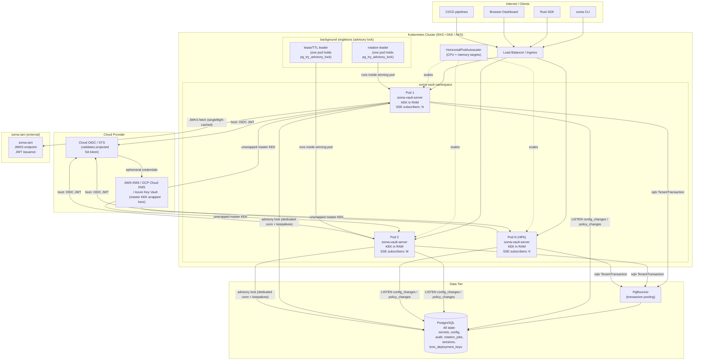

# soma-vault: Cloud-Native & Kubernetes Deployment

soma-vault runs as a stateless Kubernetes Deployment. Every pod independently proves its cloud identity to an external KMS, derives all key material in RAM, and serves traffic without any human unseal ceremony, shared secrets, or coordination with peer pods. This document specifies the pod lifecycle, workload identity setup, key hierarchy, scaling model, Kubernetes manifests, observability, and operational procedures for Phase 1.

---

## 1. Foundational Guarantee

A soma-vault pod comes up ready with **zero human ceremony and zero injected unseal secret**. It holds a cloud identity—a Kubernetes projected ServiceAccount OIDC token. That token is the only credential it ever needs to unseal. Adding ten pods under HPA means ten independent KMS Decrypt calls, each using the pod's own projected token, with no quorum, no coordination, and no operator involvement.

soma-vault takes a different approach from HashiCorp Vault's Shamir/manual-unseal model. Rather than having a human or an agent supply a secret to unlock each pod, soma-vault pods authenticate to the cloud KMS using their own workload identity — no external secret is handed to them. This is a foundational design constraint, not a configuration option.

---

## 2. Pod Boot Sequence

Every pod follows this deterministic sequence before serving traffic:

```
BOOT
 │
 ├─ 1. Read env config
 │      DATABASE_URL, KMS_PROVIDER, KMS_KEY_ARN, SOMA_IAM_JWKS_URL,
 │      LOG_LEVEL, GRACE_PERIOD_MINUTES, SQLX_POOL_MAX_SIZE
 │      All config via environment variables. No config files in the image.
 │
 ├─ 2. Prove workload identity to cloud KMS
 │      Read projected OIDC JWT from K8s-injected path
 │      Exchange JWT for ephemeral cloud credentials (IRSA / GKE WI / AKS WI)
 │      SELECT wrapped_master_kek FROM kms_deployment_keys LIMIT 1
 │      Call KMS Decrypt → unwrap master KEK into Zeroizing<[u8;32]> in RAM
 │      On failure: exponential backoff, retry for 60 seconds
 │      If still failing: readiness probe remains 503, pod never receives traffic
 │
 ├─ 3. Run embedded SQL migrations (sqlx::migrate!())
 │      Idempotent. sqlx uses pg_advisory_xact_lock internally to prevent
 │      concurrent double-application from simultaneous pod starts.
 │
 ├─ 4. Open sqlx PgPool (transaction-pooling-mode-safe)
 │      after_acquire hook: executed at connection checkout—
 │      actual tenant isolation set via SET LOCAL inside each transaction.
 │
 ├─ 5. Spawn background tasks
 │      - Postgres LISTEN relay (dedicated non-pooled connection)
 │      - Advisory-lock singleton workers (dedicated non-pooled connections)
 │
 ├─ 6. Readiness probe → HTTP 200 /health/ready
 │      Pod is now routable. Service Endpoints list includes this pod.
 │
 └─ 7. Serve traffic
        REST API + SSE (axum, port 8080)
        Prometheus metrics (port 9090)
```

### First-Boot Bootstrap

The first pod to start with an empty database generates the master KEK, wraps it, and persists it. Subsequent pods (including concurrent first-boot peers) select the committed row:

```rust
// Attempt to generate and store the master KEK for this deployment.
// ON CONFLICT DO NOTHING ensures exactly one row wins the race.
let existing: Option<Vec<u8>> = sqlx::query_scalar(
    "SELECT wrapped_master_kek FROM kms_deployment_keys WHERE deployment_id = $1"
)
.bind(&deployment_id)
.fetch_optional(&pool)
.await?;

let wrapped = if let Some(w) = existing {
    w
} else {
    let plaintext: Zeroizing<[u8; 32]> = generate_kek(); // OsRng
    let wrapped = kms.wrap_key(&plaintext).await?;
    sqlx::query(
        "INSERT INTO kms_deployment_keys (deployment_id, kms_key_id, wrapped_master_kek, kms_key_version)
         VALUES ($1, $2, $3, 1)
         ON CONFLICT (deployment_id) DO NOTHING"
    )
    .bind(&deployment_id)
    .bind(&kms_key_id)
    .bind(&wrapped)
    .execute(&pool)
    .await?;
    // Re-select: if another pod won the race, use their row.
    sqlx::query_scalar(
        "SELECT wrapped_master_kek FROM kms_deployment_keys WHERE deployment_id = $1"
    )
    .bind(&deployment_id)
    .fetch_one(&pool)
    .await?
};

let master_kek = kms.unwrap_key(&wrapped).await?;
```

The `kms_deployment_keys` table schema:

```sql
CREATE TABLE kms_deployment_keys (
    id                 UUID PRIMARY KEY DEFAULT gen_random_uuid(),
    deployment_id      TEXT NOT NULL UNIQUE,
    kms_provider       TEXT NOT NULL,
    kms_key_id         TEXT NOT NULL,
    wrapped_master_kek BYTEA NOT NULL,
    kms_key_version    INT NOT NULL DEFAULT 1,
    created_at         TIMESTAMPTZ NOT NULL DEFAULT now()
);
```

### KMS Circuit-Breaker / Grace-Period Mode

When KMS becomes transiently unreachable **after** the pod already holds cached tenant KEKs:

- Pod enters **DEGRADED** state.
- Extends in-memory tenant KEK cache TTL up to `GRACE_PERIOD_MINUTES` (default 30, max 240).
- `/health/ready` returns HTTP 200 so the pod remains in the Service Endpoints list and continues receiving traffic.
- After the grace period expires with KMS still unreachable: pod transitions to **SEALED**, stops serving traffic, emits CRITICAL structured log.

On **cold boot** (no cached KEKs), the 60-second retry window applies. If that window expires: readiness probe stays 503, pod never routes.

```
ponytail: grace-period cache ceiling is 240 minutes of KEK age.
Upgrade path: reduce max to match your KMS SLA and alert aggressively at 15 minutes.
```

---

## 3. Workload Identity Per Cloud

### 3.1 AWS EKS — IRSA (Phase 1 Primary)

IRSA (IAM Roles for Service Accounts) is the Phase 1 implementation. The `aws-config` crate picks up `AWS_WEB_IDENTITY_TOKEN_FILE` and `AWS_ROLE_ARN` automatically—zero custom credential code.

**IAM Role trust policy:**

```json
{
  "Version": "2012-10-17",
  "Statement": [{
    "Effect": "Allow",
    "Principal": {
      "Federated": "arn:aws:iam::ACCOUNT_ID:oidc-provider/oidc.eks.REGION.amazonaws.com/id/OIDC_ID"
    },
    "Action": "sts:AssumeRoleWithWebIdentity",
    "Condition": {
      "StringEquals": {
        "oidc.eks.REGION.amazonaws.com/id/OIDC_ID:sub": "system:serviceaccount:soma-vault:soma-vault-server",
        "oidc.eks.REGION.amazonaws.com/id/OIDC_ID:aud": "sts.amazonaws.com"
      }
    }
  }]
}
```

**IAM permissions policy** — exactly one permission:

```json
{
  "Version": "2012-10-17",
  "Statement": [{
    "Effect": "Allow",
    "Action": ["kms:Decrypt"],
    "Resource": "arn:aws:kms:REGION:ACCOUNT_ID:key/KMS_KEY_ID"
  }]
}
```

### 3.2 GCP GKE — Workload Identity (Phase 2 implementation; trait wired)

```bash
gcloud iam service-accounts add-iam-policy-binding \
  soma-vault-kms@PROJECT_ID.iam.gserviceaccount.com \
  --role roles/iam.workloadIdentityUser \
  --member "serviceAccount:PROJECT_ID.svc.id.goog[soma-vault/soma-vault-server]"

kubectl annotate serviceaccount soma-vault-server \
  --namespace soma-vault \
  iam.gke.io/gcp-service-account=soma-vault-kms@PROJECT_ID.iam.gserviceaccount.com
```

### 3.3 AKS — Azure Workload Identity (Phase 2 implementation; trait wired)

```bash
az identity federated-credential create \
  --name soma-vault-federated \
  --identity-name soma-vault-kms \
  --resource-group RG \
  --issuer "https://oidc.prod-aks.azure.com/TENANT_ID/CLUSTER_ID" \
  --subject "system:serviceaccount:soma-vault:soma-vault-server" \
  --audiences "api://AzureADTokenExchange"
```

### 3.4 SPIFFE/SPIRE (Phase 2)

SPIFFE/SPIRE is the on-prem and multi-cloud path deferred to Phase 2. The `KmsBackend` trait abstracts the token source; a SPIFFE JWT-SVID from the SPIRE Workload API at a Unix socket is a drop-in token source with no other structural changes.

---

## 4. `KmsBackend` Trait

All KMS interaction is behind one trait. This is the only place cloud-specific code lives.

```rust
#[async_trait]
pub trait KmsBackend: Send + Sync {
    /// Wrap a 32-byte plaintext key using the external KMS key.
    async fn wrap_key(&self, plaintext: &[u8; 32]) -> Result<Vec<u8>, KmsError>;

    /// Unwrap a previously wrapped key. Caller places result in Zeroizing<[u8; 32]>.
    async fn unwrap_key(&self, wrapped: &[u8]) -> Result<Zeroizing<[u8; 32]>, KmsError>;
}

pub enum KmsProvider {
    AwsKms,
    // ponytail: GCP and Azure are trait-wired but unimplemented; Phase 2.
    // GcpKms,
    // AzureKeyVault,
    Software, // age-based fallback for self-host
}
```

On pod boot, exactly one `unwrap_key` call loads the master KEK from `kms_deployment_keys`. The result lives in `Arc<Zeroizing<[u8; 32]>>` for the process lifetime. No further KMS calls occur on the secret-read hot path—per-tenant KEKs are derived in RAM via HKDF.

---

## 5. Key Hierarchy in Pod RAM

```
KMS key (AWS CMK / GCP Cloud KMS / Azure Key Vault)
  │  [Layer 0 — never leaves the HSM]
  │
  └─ master_kek: Zeroizing<[u8; 32]>   [Layer 1 — pod RAM only, loaded once on boot]
       │  stored encrypted in kms_deployment_keys.wrapped_master_kek
       │
       └─ per_tenant_kek = HKDF-SHA256(master_kek,
       │      salt  = b"soma-vault-tenant-kek-v1",
       │      info  = tenant_id_bytes)   [Layer 2 — derived on first request per tenant]
       │      cache: Arc<RwLock<LruCache<TenantId, Box<Zeroizing<[u8;32]>>>>>
       │      TTL = 5 min, ZeroizeOnDrop on eviction
       │      Box pins the allocation to prevent move-induced stale memory
       │
       └─ per_secret_dek: Zeroizing<[u8; 32]>   [Layer 3 — generated per write, <1ms lifetime]
              AES-256-GCM encrypt(secret_plaintext,
                                  nonce = OsRng 96-bit,
                                  aad   = secret_id_bytes || version_id_bytes)
              wrapped_dek = AES Key Wrap RFC 3394 (aes-kw crate)
                            wrap(tenant_kek, per_secret_dek)
              — nonceless by design; AES-KW is the correct algorithm here,
                not AES-GCM; see §5.1 for the algorithm note
              Zeroize per_secret_dek immediately after wrap.
              Store in Postgres: (ciphertext, wrapped_dek, nonce)
```

A Postgres dump contains only `(ciphertext, wrapped_dek, nonce)`. Without KMS access it is cryptographically useless.

### 5.1 DEK Wrapping Algorithm Note

DEK wrapping uses **AES Key Wrap (RFC 3394, `aes-kw` crate)**, not AES-GCM. AES-KW is nonceless by design and is the correct algorithm for key-under-key wrapping—it provides integrity assurance without requiring a separate nonce storage column. The `nonce` column in `secret_versions` belongs exclusively to the secret-value AES-256-GCM AEAD. The `wrapped_dek` column holds RFC 3394 AES-KW output. These two operations must never be conflated in implementation.

### 5.2 Audit HMAC Key Separation

The audit HMAC key is derived from a **separate KMS-wrapped root** distinct from the master KEK:

```
audit_hmac_root: Zeroizing<[u8; 32]>   [loaded from kms_deployment_keys.wrapped_audit_root]
  └─ per_tenant_audit_hmac = HKDF-SHA256(audit_hmac_root,
         salt = b"soma-vault-audit-hmac-v1",
         info = tenant_id_bytes)
```

This ensures a master KEK compromise does not simultaneously break audit log integrity. A compromised master KEK exposes secret ciphertext (wrapped DEKs decryptable); the audit HMAC key remains independent.

### 5.3 AAD Binding

The AEAD additional data for each secret version encryption is `secret_id_bytes || version_id_bytes` (raw UUID bytes, concatenated). This prevents ciphertext transplant attacks—decryption with a mismatched `(secret_id, version_id)` pair fails the AEAD tag check. The `aad_fingerprint` column stores `SHA-256(secret_id_bytes || version_id_bytes)` as a diagnostic field for integrity auditing; it is **not** the security mechanism (the AEAD tag is). On every decrypt, the implementation verifies the AEAD tag against the live `secret_id` and `version_id`, not against the stored fingerprint. If `aad_fingerprint` is retained, it must be verified with `subtle::ConstantTimeEq` before decryption proceeds, or removed. Storing it without verifying it creates false assurance.

---

## 6. Scaling: Stateless Pods, One Postgres

### Connection Pooling

Every pod opens its own `sqlx::PgPool` configured for PgBouncer transaction-pooling mode compatibility:

- Every repository function accepts a `&mut Transaction<'_, Postgres>`, not a `&PgPool`. This is enforced at the type level via a `TenantTransaction<'_>` newtype wrapping `Transaction`.
- The first statement inside every transaction: `SET LOCAL app.tenant_id = $1`. This sets the RLS context for that transaction.
- No session-scoped settings. No PREPARE statements in transaction-pooling mode.
- `after_acquire` hook: reset to a known-clean state only; tenant context is set per-transaction.

**Why `&mut Transaction` not `&PgPool`:** `SET LOCAL` is a no-op outside an explicit transaction (in autocommit mode, the implicit transaction ends before any subsequent query runs). Requiring `Transaction` at the type level makes autocommit-mode queries unreachable from repository code, ensuring the RLS defense-in-depth layer never silently fires with an empty tenant context.

**Recommended connection sizing per pod:**

| Pods | Pool size / pod | Total DB connections |
|------|-----------------|----------------------|
| 1    | 10              | 10                   |
| 5    | 10              | 50                   |
| 20   | 5               | 100                  |
| 50   | 3               | 150                  |

Cap total at `max_connections - 5`. Tune via `SQLX_POOL_MAX_SIZE` env var. PgBouncer in front of Postgres is strongly recommended for managed cloud deployments.

### No In-Pod Shared State

Pods are stateless:

- No Raft. No cluster membership. No peer-to-peer communication.
- All mutable application state lives in Postgres.
- SSE broadcast channels (`tokio::sync::broadcast`) are per-pod. Cross-pod fan-out uses Postgres `LISTEN/NOTIFY`.
- Policy cache invalidation: after any write to the `policies` table, the handler sends `NOTIFY policy_changes, '{"tenant_id":"...", "workspace_id":"..."}'`. Each pod's LISTEN relay clears the in-memory radix trie cache for that tenant.

```
ponytail: cross-pod LISTEN/NOTIFY ceiling is ~50 pods × subscriber count
before DB notification fan-out becomes measurable load.
Upgrade path: Redis pub/sub as a relay, replacing Postgres NOTIFY.
```

### LISTEN Connection Health

The dedicated non-pooled Postgres LISTEN connection must be actively health-checked. If the connection drops silently (network blip, PgBouncer recycle, Postgres restart), SSE clients continue receiving keepalive pings but receive no config change events—a silent stale-config condition.

Required behavior:

1. Heartbeat: send `SELECT 1` every 30 seconds on the LISTEN connection; reconnect with exponential backoff on failure.
2. On reconnect: send a synthetic `stream_interrupted` SSE event to all current subscribers so SDK clients fall back to polling and perform a full cache re-seed.

---

## 7. Background Singleton Workers

Three background tasks must run on exactly one pod across all replicas:

1. **Rotation sweeper** — claims and executes `rotation_jobs` rows.
2. **Lease/TTL expiry sweeper** — marks expired leases.
3. **Audit integrity flush** — Phase 2 stub only in Phase 1.

### Advisory Lock on a Dedicated Non-Pooled Connection

Each worker holds a **session-level advisory lock** on a **dedicated non-pooled connection** outside `sqlx::PgPool`. If a pooled connection held the lock, pool recycling would produce a zombie lock held by no active worker.

**TCP keepalives are required** on these dedicated connections. An OOM-killed pod receives SIGKILL; the kernel does not immediately close the TCP connection. Without keepalives, Postgres detects the dead session only after the OS-level keepalive timeout (Linux default: 7200 seconds), stalling singleton workers for up to two hours. Set these connection string parameters:

```
keepalives=1 keepalives_idle=60 keepalives_interval=10 keepalives_count=3
```

Or via sqlx `ConnectOptions::tcp_keepalives`. These are **required**, not optional.

```rust
// Dedicated connection — NOT from the pool.
let mut advisory_conn = PgConnectOptions::from_str(&database_url)?
    .tcp_keepalives(true)
    .tcp_keepalives_idle(Duration::from_secs(60))
    .tcp_keepalives_interval(Duration::from_secs(10))
    .tcp_keepalives_retries(3)
    .connect()
    .await?;

// Stable integer IDs documented in a central constants file.
// hash("soma:leader:rotation")
const ROTATION_LOCK_ID: i64 = 0x736f6d615f726f74;
// hash("soma:leader:lease")
const LEASE_LOCK_ID: i64 = 0x736f6d615f6c6561;

loop {
    let acquired: bool = sqlx::query_scalar("SELECT pg_try_advisory_lock($1)")
        .bind(ROTATION_LOCK_ID)
        .fetch_one(&mut advisory_conn)
        .await?;

    if acquired {
        run_rotation_sweep_loop(&pool).await; // does not return while healthy
    } else {
        tokio::time::sleep(Duration::from_secs(30)).await;
    }
}
```

**Crash-safety:** Pod crash drops the TCP connection; Postgres releases the session-level advisory lock. Remaining pods acquire on their next 30-second poll. Failover time is bounded by the poll interval.

```
ponytail: 50 pods polling pg_try_advisory_lock every 30s ≈ 1.7 QPS from lock
polling alone. Upgrade path: Kubernetes Lease object (coordination.k8s.io/v1)
for leader election, reducing DB polling to zero.
```

### SKIP LOCKED for Work Rows

Workers claim job rows atomically. The advisory lock determines which pod initiates the sweep; `SKIP LOCKED` prevents double-processing if two pods briefly believe they are leader during failover:

```sql
SELECT id, secret_id, tenant_id, status, stage, rotation_version, next_attempt_at
FROM rotation_jobs
WHERE status = 'pending'
  AND next_attempt_at <= now()
ORDER BY next_attempt_at
LIMIT 10
FOR UPDATE SKIP LOCKED;
```

The double-rotation guard is enforced by a **partial unique index**, not a plain UNIQUE constraint. A plain `UNIQUE (secret_id, status)` allows one `pending` row and one `in_progress` row for the same secret to coexist—exactly the case it should prevent:

```sql
CREATE UNIQUE INDEX uq_rotation_active ON rotation_jobs (secret_id)
    WHERE status IN ('pending', 'in_progress');
```

---

## 8. Software-KMS Fallback for Self-Host

For self-hosters without AWS/GCP/Azure, soma-vault ships an `AgeSoftwareKms` backend.

**Mechanism:** The master KEK is encrypted with the `age` crate (X25519 identity) and stored as `soma-vault-master.age`. The age private key is stored in a Kubernetes Secret with namespace-scoped RBAC restricted to the `soma-vault-server` ServiceAccount.

**Documented tradeoff (stated in the health endpoint response and in these docs, not hidden):**

> This backend degrades security to: "master KEK protected by Kubernetes etcd encryption-at-rest and RBAC." Any principal with cluster-admin access can read the age private key from etcd. This is equivalent to Infisical's `ENCRYPTION_KEY` environment variable model. The `/health/ready` response includes `"seal_backend": "software_kms", "seal_backend_severity": "WARNING"`. Operators who require the full tenet-3 guarantee—no mounted secret, no static credential—must use a cloud KMS backend.

**Age identity Kubernetes RBAC:**

```yaml
apiVersion: rbac.authorization.k8s.io/v1
kind: Role
metadata:
  name: soma-vault-kms-identity-reader
  namespace: soma-vault
rules:
- apiGroups: [""]
  resources: ["secrets"]
  resourceNames: ["soma-vault-kms-identity"]
  verbs: ["get"]
---
apiVersion: rbac.authorization.k8s.io/v1
kind: RoleBinding
metadata:
  name: soma-vault-kms-identity-reader
  namespace: soma-vault
subjects:
- kind: ServiceAccount
  name: soma-vault-server
roleRef:
  kind: Role
  name: soma-vault-kms-identity-reader
  apiGroup: rbac.authorization.k8s.io
```

**Age identity rotation runbook (Phase 1):**

1. Generate a new age identity: `age-keygen -o new-identity.txt`.
2. Re-encrypt the master KEK file with both the old and new identities (dual-recipient): `age -r OLD_PUBKEY -r NEW_PUBKEY -o soma-vault-master.age <plaintext>`.
3. Update the Kubernetes Secret to include both identity files.
4. Perform a rolling restart: `kubectl rollout restart deployment/soma-vault-server -n soma-vault`.
5. After all pods have restarted successfully, re-encrypt the master KEK with only the new identity and update the Kubernetes Secret again.
6. Verify no pod references the old identity: `kubectl rollout status deployment/soma-vault-server -n soma-vault`.

---

## 9. Session Tokens

soma-vault issues its own short-lived session tokens after validating a soma-iam JWT. Tokens are signed RS256 JWTs (private key derived from the master KEK via HKDF with salt `b"soma-vault-session-key-v1"`), validated by signature check—no database read on the hot path.

**Token hashing in the `sessions` table (for revocation tracking):** tokens are hashed as `HMAC-SHA256(session_hmac_key, raw_token)` where `session_hmac_key` is derived from the master KEK via HKDF with salt `b"soma-vault-session-hmac-v1"`. Plain SHA-256 without an HMAC key allows offline dictionary attacks against the `sessions` table if an attacker obtains a Postgres dump; HMAC ties the hash to the master KEK.

**Explicit logout / forced revocation:** maintains a bounded in-memory set of revoked JTIs. Data loss on pod restart is acceptable given the 15-minute token TTL—a revoked token is at most valid for 15 minutes on a pod that restarted.

**JWT replay prevention:** the `jti` claim from each soma-iam JWT is recorded in a `jti_replay_cache` table (columns: `jti TEXT, expires_at TIMESTAMPTZ`) and checked at `/v1/auth/login`. A soma-iam JWT cannot be exchanged for a soma-vault session token more than once. Expired entries are pruned by the lease expiry sweeper.

---

## 10. Health, Liveness, and Readiness

### `/health/live`

Returns HTTP 200 as long as the Tokio runtime is not stuck. Almost never fails.

```json
{ "status": "alive" }
```

### `/health/ready`

| Condition | `status` | HTTP | In Service Endpoints |
|-----------|----------|------|----------------------|
| KMS unsealed, DB connected | `"ok"` | 200 | Yes |
| KMS unreachable, grace period active | `"degraded"` | 200 | Yes |
| DB pool exhausted | `"degraded"` | 200 | Yes |
| Grace period expired | `"sealed"` | 503 | No |
| Boot: KMS retry window active | `"starting"` | 503 | No |
| DB unreachable | `"starting"` | 503 | No |

```json
{
  "status": "degraded",
  "seal_backend": "aws_kms",
  "seal_backend_severity": "OK",
  "active_alerts": ["kms_unreachable"],
  "grace_period_remaining_seconds": 1620
}
```

**Note on HPA:** returning HTTP 200 in DEGRADED state keeps the pod in the Service Endpoints list so it continues receiving traffic. HPA scaling decisions are driven by CPU and memory metrics, not readiness probe results. To suppress HPA scale-down during a degraded event, configure an HPA behavior rule tied to the `soma_vault_kms_grace_period_active` Prometheus gauge.

### `/health/startup`

Used only by the Kubernetes `startupProbe` during the boot KMS retry window. Returns 503 while the KMS retry window is active (first 60 seconds post-boot), then transitions to 200 once KMS succeeds or the retry window expires. After first success, it never returns to 503—unlike `/health/ready`, which can return 503 if the grace period expires post-boot.

```json
{ "status": "starting", "kms_retry_seconds_remaining": 42 }
```

---

## 11. Observability

### Structured Logs

All logs are JSON (`tracing` + `tracing-subscriber` with `json` feature). No secret values or key material appear in any log line.

Required fields per log entry:

- `tenant_id`: always present on request-scoped logs (hashed for filtering)
- `request_id`: UUID injected by `tower-http` `SetRequestIdLayer`
- `level`, `timestamp`, `target`, `message`
- Errors: `error_code`, `error_message` (no stack traces in production)

Secret paths are **not** logged in plaintext on read events; the audit log uses HMAC-hashed resource names.

### Prometheus Metrics (port 9090, path `/metrics`)

No metric includes secret values, plaintext key material, or unhashed identifiers. `tenant_id` labels use a truncated HMAC so cardinality is bounded at thousands of tenants.

| Metric | Type | Description |
|--------|------|-------------|
| `soma_vault_kms_unseal_total` | Counter | KMS unwrap attempts (`result=ok/error`) |
| `soma_vault_kms_grace_period_active` | Gauge | 1 if pod is in grace-period degraded mode |
| `soma_vault_secret_reads_total` | Counter | Secret reads (`outcome=ok/denied/error`) |
| `soma_vault_config_reads_total` | Counter | Config reads |
| `soma_vault_db_pool_size` | Gauge | Active DB connections |
| `soma_vault_db_pool_idle` | Gauge | Idle DB connections |
| `soma_vault_sse_subscribers` | Gauge | Active SSE connections on this pod |
| `soma_vault_jwks_refetch_total` | Counter | JWKS re-fetches on kid miss (monitor for kid-exhaustion DoS) |
| `soma_vault_http_request_duration_seconds` | Histogram | Per-route latency (`route`, `method`, `status`) |

### JWKS Cache

On `kid` miss, exactly one in-flight JWKS fetch is initiated using a singleflight/`OnceCell` pattern; concurrent miss-waiters block on the same future (no thundering-herd against soma-iam). Unknown `kid` values are negatively cached for 60 seconds. A circuit breaker stops re-fetching if N consecutive fetches fail; all unknown-kid tokens are rejected with 401 until the circuit resets.

---

## 12. Kubernetes Manifests

### Namespace and ServiceAccount

```yaml
apiVersion: v1
kind: Namespace
metadata:
  name: soma-vault
---
apiVersion: v1
kind: ServiceAccount
metadata:
  name: soma-vault-server
  namespace: soma-vault
  annotations:
    # EKS IRSA — replace with your IAM Role ARN
    eks.amazonaws.com/role-arn: "arn:aws:iam::ACCOUNT_ID:role/soma-vault-kms-role"
    # GKE Workload Identity (uncomment for GKE, Phase 2)
    # iam.gke.io/gcp-service-account: soma-vault-kms@PROJECT_ID.iam.gserviceaccount.com
    # AKS Workload Identity (uncomment for AKS, Phase 2)
    # azure.workload.identity/client-id: "MANAGED_IDENTITY_CLIENT_ID"
```

### ConfigMap

Non-sensitive configuration only. `DATABASE_URL` comes from a Kubernetes Secret.

```yaml
apiVersion: v1
kind: ConfigMap
metadata:
  name: soma-vault-config
  namespace: soma-vault
data:
  KMS_PROVIDER: "aws"
  KMS_KEY_ARN: "arn:aws:kms:us-east-1:ACCOUNT_ID:key/KMS_KEY_ID"
  SOMA_IAM_JWKS_URL: "https://iam.soma-platform.com/.well-known/jwks.json"
  LOG_LEVEL: "info"
  METRICS_PORT: "9090"
  GRACE_PERIOD_MINUTES: "30"
  SQLX_POOL_MAX_SIZE: "10"
```

### Deployment

```yaml
apiVersion: apps/v1
kind: Deployment
metadata:
  name: soma-vault-server
  namespace: soma-vault
  labels:
    app: soma-vault-server
spec:
  # Do NOT set replicas here — HPA manages this.
  selector:
    matchLabels:
      app: soma-vault-server
  strategy:
    type: RollingUpdate
    rollingUpdate:
      maxSurge: 1
      maxUnavailable: 0    # Zero-downtime rolling deploys
  template:
    metadata:
      labels:
        app: soma-vault-server
        # Required for AKS Workload Identity:
        # azure.workload.identity/use: "true"
    spec:
      serviceAccountName: soma-vault-server
      automountServiceAccountToken: true    # Required for IRSA projected token

      # No PersistentVolumeClaims. All state is in Postgres.

      terminationGracePeriodSeconds: 30

      containers:
      - name: soma-vault-server
        image: ghcr.io/soma-platform/soma-vault-server:latest
        imagePullPolicy: Always
        ports:
        - name: api
          containerPort: 8080
          protocol: TCP
        - name: metrics
          containerPort: 9090
          protocol: TCP

        envFrom:
        - configMapRef:
            name: soma-vault-config
        env:
        - name: DATABASE_URL
          valueFrom:
            secretKeyRef:
              name: soma-vault-db
              key: url

        resources:
          requests:
            cpu: 100m
            memory: 64Mi
          limits:
            cpu: 500m
            memory: 256Mi

        startupProbe:
          httpGet:
            path: /health/startup
            port: api
          initialDelaySeconds: 5
          periodSeconds: 5
          failureThreshold: 18      # 90s total — covers 60s KMS retry window

        readinessProbe:
          httpGet:
            path: /health/ready
            port: api
          initialDelaySeconds: 0
          periodSeconds: 5
          failureThreshold: 2
          successThreshold: 1

        livenessProbe:
          httpGet:
            path: /health/live
            port: api
          initialDelaySeconds: 10
          periodSeconds: 10
          failureThreshold: 3

        securityContext:
          readOnlyRootFilesystem: true
          allowPrivilegeEscalation: false
          runAsNonRoot: true
          runAsUser: 10001
          capabilities:
            drop: [ALL]

      securityContext:
        seccompProfile:
          type: RuntimeDefault

      affinity:
        podAntiAffinity:
          preferredDuringSchedulingIgnoredDuringExecution:
          - weight: 100
            podAffinityTerm:
              labelSelector:
                matchLabels:
                  app: soma-vault-server
              topologyKey: topology.kubernetes.io/zone
```

### Service

```yaml
apiVersion: v1
kind: Service
metadata:
  name: soma-vault-server
  namespace: soma-vault
spec:
  selector:
    app: soma-vault-server
  ports:
  - name: api
    port: 443
    targetPort: api
    protocol: TCP
  - name: metrics
    port: 9090
    targetPort: metrics
    protocol: TCP
  type: ClusterIP
```

### HorizontalPodAutoscaler

```yaml
apiVersion: autoscaling/v2
kind: HorizontalPodAutoscaler
metadata:
  name: soma-vault-server
  namespace: soma-vault
spec:
  scaleTargetRef:
    apiVersion: apps/v1
    kind: Deployment
    name: soma-vault-server
  minReplicas: 2     # Minimum 2 for HA; advisory lock works at 1 but HA requires 2+
  maxReplicas: 20
  metrics:
  - type: Resource
    resource:
      name: cpu
      target:
        type: Utilization
        averageUtilization: 60
  - type: Resource
    resource:
      name: memory
      target:
        type: Utilization
        averageUtilization: 70
  behavior:
    scaleUp:
      stabilizationWindowSeconds: 60
      policies:
      - type: Pods
        value: 2
        periodSeconds: 60
    scaleDown:
      stabilizationWindowSeconds: 300    # Slow scale-down to let KEK cache warm on survivors
```

### PodDisruptionBudget

```yaml
apiVersion: policy/v1
kind: PodDisruptionBudget
metadata:
  name: soma-vault-server
  namespace: soma-vault
spec:
  minAvailable: 1
  selector:
    matchLabels:
      app: soma-vault-server
```

---

## 13. Deployment Topology



Key properties:

- Every pod independently proves its identity to the KMS. No pod-to-pod communication for unseal.
- The KMS is on the boot path only (plus grace-period extension). Not on the secret-read hot path.
- All pods share one Postgres via PgBouncer. No distributed state between pods.
- Advisory locks for singleton workers live in Postgres on dedicated keepalive-enabled connections—no etcd, no Redis, no Kubernetes LeaderElection.
- SSE subscribers connect to individual pods; cross-pod fan-out uses Postgres LISTEN/NOTIFY.
- Policy revocations propagate to all pods via NOTIFY, not only at cache TTL expiry.

---

## 14. Environment Variable Reference

All pod configuration is via environment variables. No config files are mounted into the container.

| Variable | Required | Default | Description |
|----------|----------|---------|-------------|
| `DATABASE_URL` | Yes | — | Postgres connection string |
| `KMS_PROVIDER` | Yes | — | `aws`, `software` (GCP/Azure: Phase 2) |
| `KMS_KEY_ARN` | AWS only | — | ARN of the AWS KMS CMK |
| `KMS_IDENTITY_PATH` | software only | — | Path to age private key file |
| `KMS_MASTER_KEY_FILE` | software only | — | Path to age-encrypted master KEK file |
| `SOMA_IAM_JWKS_URL` | Yes | — | URL to soma-iam's JWKS endpoint |
| `LOG_LEVEL` | No | `info` | `trace`, `debug`, `info`, `warn`, `error` |
| `METRICS_PORT` | No | `9090` | Internal port for Prometheus `/metrics` |
| `GRACE_PERIOD_MINUTES` | No | `30` | Max minutes to serve from cached KEKs when KMS is unreachable |
| `SQLX_POOL_MAX_SIZE` | No | `10` | Max connections per pod in sqlx pool |
| `SESSION_TOKEN_TTL_SECONDS` | No | `900` | soma-vault session token TTL |
| `TENANT_KEK_CACHE_TTL_SECONDS` | No | `300` | Per-tenant KEK cache TTL |
| `AWS_WEB_IDENTITY_TOKEN_FILE` | EKS (auto) | — | Injected by EKS admission controller |
| `AWS_ROLE_ARN` | EKS (auto) | — | Injected by EKS admission controller |

No secret values appear in environment variables in cloud deployments. `DATABASE_URL` is sourced from a Kubernetes Secret or an external secret syncer (the operator does not read it from ConfigMap).

---

## 15. Helm Chart Structure

```
chart/
  Chart.yaml
  values.yaml
  templates/
    namespace.yaml
    serviceaccount.yaml
    configmap.yaml
    deployment.yaml
    service.yaml
    hpa.yaml
    pdb.yaml
    rbac.yaml    # Role + RoleBinding for software-KMS fallback only
```

Key `values.yaml` sections:

```yaml
replicaCount: null    # null = HPA-managed; set a number to disable HPA

image:
  repository: ghcr.io/soma-platform/soma-vault-server
  tag: latest
  pullPolicy: Always

kms:
  provider: aws
  keyArn: ""
  softwareIdentitySecretName: ""

somaIam:
  jwksUrl: ""

database:
  secretName: soma-vault-db    # K8s Secret containing DATABASE_URL

hpa:
  enabled: true
  minReplicas: 2
  maxReplicas: 20
  cpuTargetUtilization: 60
  memoryTargetUtilization: 70

pgbouncer:
  enabled: false    # Recommended true for managed cloud at scale

resources:
  requests:
    cpu: 100m
    memory: 64Mi
  limits:
    cpu: 500m
    memory: 256Mi

serviceAccount:
  annotations: {}    # Add eks.amazonaws.com/role-arn here for IRSA
```

The chart does **not** deploy Postgres. Postgres is an operator-provided dependency (AWS RDS, Cloud SQL, self-hosted). No second stateful dependency is introduced.

---

## 16. Security Hardening Checklist

All items are Phase 1 requirements.

- [x] `readOnlyRootFilesystem: true`
- [x] `allowPrivilegeEscalation: false`
- [x] `runAsNonRoot: true`, `runAsUser: 10001`
- [x] `capabilities: drop: [ALL]`
- [x] `seccompProfile: RuntimeDefault`
- [x] No `hostNetwork`, `hostPID`, or `hostIPC`
- [x] `automountServiceAccountToken: true` — scoped to KMS audience only; not a general Kubernetes API credential
- [x] The soma-vault ServiceAccount has **no Kubernetes RBAC permissions** except for the software-KMS fallback (read one named Secret)
- [x] Pod anti-affinity spreads replicas across availability zones
- [x] TCP keepalives on all dedicated advisory-lock connections (`keepalives_idle=60`)
- [x] TLS termination via rustls 0.23 with aws-lc-rs backend (no OpenSSL)
- [x] Session tokens hashed with HMAC-SHA256 (not plain SHA-256) in the sessions table
- [x] Dashboard session token stored in httpOnly, Secure, SameSite=Strict cookie (not sessionStorage); CSRF protection via Double Submit Cookie pattern
- [x] Postgres superuser access bypasses FORCE ROW LEVEL SECURITY — documented explicitly: envelope encryption is the cryptographic boundary against Postgres-level attackers; RLS does not protect against superuser access

**Network Policy (apply separately from the Helm chart):**

```yaml
apiVersion: networking.k8s.io/v1
kind: NetworkPolicy
metadata:
  name: soma-vault-server
  namespace: soma-vault
spec:
  podSelector:
    matchLabels:
      app: soma-vault-server
  policyTypes: [Ingress, Egress]
  ingress:
  - from:
    - namespaceSelector:
        matchLabels:
          kubernetes.io/metadata.name: ingress-nginx
    ports:
    - protocol: TCP
      port: 8080
  - from:
    - namespaceSelector:
        matchLabels:
          kubernetes.io/metadata.name: monitoring
    ports:
    - protocol: TCP
      port: 9090
  egress:
  - {}    # Allow all egress (KMS API, soma-iam JWKS, Postgres)
```

---

## 17. Backup and Restore

### Postgres Backup

Postgres backups (pg_dump, WAL archival) capture only ciphertext—no plaintext secret values. A backup is cryptographically useless without KMS access. Before restoring from a backup:

1. Verify KMS access is available: `soma vault verify-kms` (calls KMS Decrypt on the wrapped master KEK and immediately discards the result).
2. Restore the Postgres backup.
3. Start soma-vault-server; pods will unseal normally.

For cloud KMS, the KMS key itself must not have been deleted or disabled. For software-KMS, the age private key must be available—**loss of the age private key is permanent data loss** with no recovery path.

### KMS Key Rotation

KMS key rotation is a multi-step process requiring careful ordering to avoid a split-brain decryption window:

1. Wrap the master KEK with the new KMS key version. Insert a new row into `kms_deployment_keys` with `kms_key_version = N+1` and the new `wrapped_master_kek`.
2. Begin the background re-encryption job: for each `secret_versions` row, decrypt the wrapped DEK using the tenant KEK derived from the old master KEK, then re-wrap using the tenant KEK derived from the new master KEK. Record `kms_key_version = N+1` on each updated row.
3. The old KMS key version **must remain active** until re-encryption is 100% complete and verified. Pods loading old `kms_key_version` rows must be able to derive the old tenant KEK—meaning they must hold both master KEK generations during the transition.
4. After re-encryption is complete and all `secret_versions` rows show `kms_key_version = N+1`, disable the old KMS key version.

The `soma vault verify-encryption` CLI command spot-checks a random sample of `secret_versions` rows across tenants to confirm they are decryptable with the current master KEK.

### Schema Compatibility During Rolling Deploys

Every migration applied during a rolling deploy must satisfy forward compatibility: old-pod code running against the new schema must not error or produce incorrect results. Rules:

- New columns must be nullable or have a constant (not computed) default.
- No column renames in a single migration—use expand-contract over two deploys.
- New enum values are added before the code that references them.

On pod startup, soma-vault checks that the applied migration count in `_sqlx_migrations` matches the compiled-in expected count. Mismatch fails the readiness probe early.

---

## 18. Operational Runbook

### Rolling Deploy

```bash
# Helm upgrade triggers RollingUpdate (maxUnavailable: 0).
# Each new pod unseals via KMS before the old pod is terminated.
# Readiness probe gates ensure zero downtime.
helm upgrade soma-vault ./chart \
  --namespace soma-vault \
  --set image.tag=v1.2.3 \
  --wait
```

### Manual Scale Override

```bash
# HPA manages replicas normally. Override only for debugging.
kubectl scale deployment soma-vault-server --replicas=5 -n soma-vault

# Restore HPA control:
kubectl patch deployment soma-vault-server -n soma-vault \
  -p '{"spec":{"replicas":null}}'
```

### Verify Audit Chain Integrity

```bash
# Admin-only, rate-limited endpoint.
curl -H "Authorization: Bearer $ADMIN_TOKEN" \
  "https://soma-vault.internal/v1/audit/verify?from=2026-06-01&to=2026-06-30"
# Returns: {"status":"intact"} or {"status":"broken","first_bad_seq":1234567}
```

### Check KMS / Seal Status

```bash
kubectl exec -n soma-vault deploy/soma-vault-server -- \
  wget -qO- http://localhost:8080/health/ready
```

### Advisory Lock Failover Test

```bash
# Kill the pod holding the rotation sweeper lock.
kubectl delete pod -n soma-vault -l app=soma-vault-server --field-selector=...
# Within 90 seconds (30s poll + margin), another pod acquires the lock.
# Verify via structured log: {"message":"rotation_leader_acquired","pod":"..."}
```

---

## 19. Phase 2 Items (Structural Stubs Present in Phase 1)

These are deferred. Phase 1 accommodates them without retrofitting:

- **GCP Cloud KMS and Azure Key Vault backends**: `KmsBackend` trait defined; implementations return `Err(KmsError::NotImplemented)`.
- **SPIFFE/SPIRE workload identity**: token source is abstracted; no SPIRE server is deployed.
- **Kubernetes LeaderElection (coordination.k8s.io/v1 Lease)**: named upgrade path for Postgres advisory lock polling in all `ponytail:` comments at advisory lock callsites.
- **Redis pub/sub for cross-pod SSE fan-out**: named upgrade path for Postgres LISTEN/NOTIFY in all `ponytail:` comments at broadcast channel init.
- **PgBouncer as required dependency**: optional in Phase 1, documented as recommended for managed cloud at scale.
- **Kubernetes mutating admission webhook / sidecar injector**: Phase 2 (cluster-critical; deferred).
- **Secrets Store CSI Driver provider**: Phase 2.
- **Multi-region active-active**: Phase 3.
- **BYOK/CMEK per-project KMS keys**: `KmsBackend` trait supports it; Phase 2 enterprise tier.
